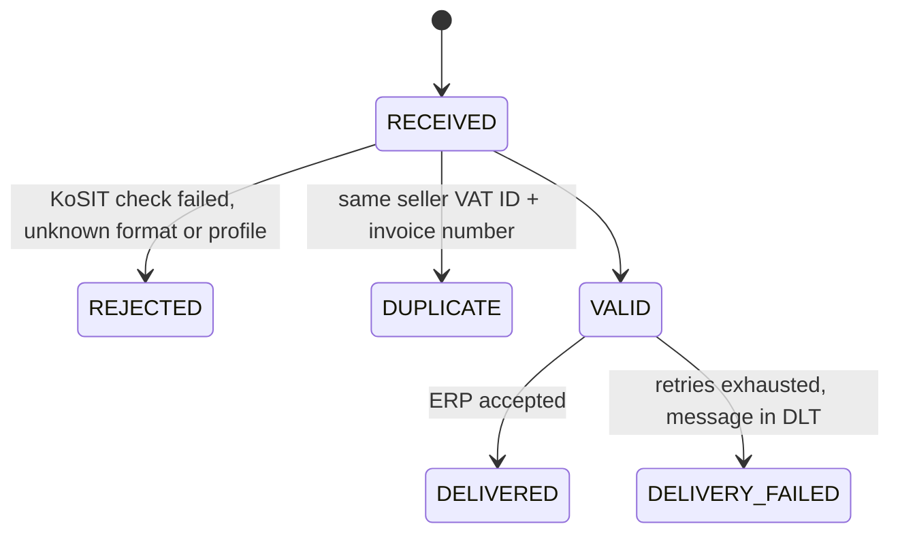
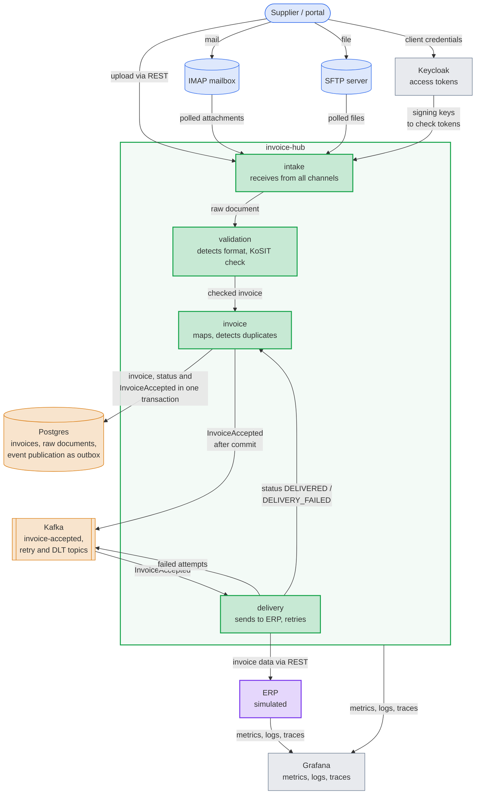

# E-Invoice Hub

[](https://github.com/manuscode/e-invoice-hub/actions/workflows/build.yml)

A service that receives e-invoices over REST, mail and SFTP, validates them with the official KoSIT rules and delivers
them reliably to the ERP. Small scope, but built like a production system.

**Tech stack:** Java 25 · Spring Boot 4 · Spring Modulith · Kafka · Postgres · Keycloak · KoSIT Validator ·
Mustang · OpenTelemetry · Grafana · Testcontainers · k6

## Problem

Since 1 January 2025 all companies in Germany must be able to receive e-invoices (XRechnung, ZUGFeRD).
In many companies it still looks like this:

- Invoices come by mail, as PDF, XML or both.
- Someone checks them by hand and types them into the ERP.
- Duplicates and wrong invoices are found late, often only at payment.

## Solution

The hub is the one entry point for incoming invoices:

- **Receive** over three channels: REST upload, IMAP mailbox and SFTP directory.
- **Detect the format:** XRechnung UBL, XRechnung CII and ZUGFeRD / Factur-X PDF. Everything else is rejected.
- **Validate** with the [KoSIT Validator](https://github.com/itplr-kosit/validator) and the official XRechnung
  configuration, the same rules the public authorities use. Each invoice gets a validation report.
- **Detect duplicates:** the same document again returns the existing invoice. The same invoice as other document
  (e.g. as PDF by mail and as XML by SFTP) gets status `DUPLICATE` with a link to the original.
- **Deliver** valid invoices to the ERP via REST, with retry and dead letter topic. An ERP that is down doesn't lose
  invoices and doesn't slow down the intake.
- **Operate:** metrics, logs and traces in Grafana. One invoice can be followed from the upload to the ERP.

Invoice status:



## Architecture

Arrows show how invoices and data flow.



Blue: input channels · Green: the hub and its modules · Amber: storage and messaging · Purple: target system ·
Gray: security and operations

- **One Spring Boot service** (Java 25, Spring Boot 4) with four modules. The code dependencies go
  `intake` → `validation` → `invoice` ← `delivery`, `invoice` doesn't know who consumes its events.
  Spring Modulith checks the module borders on every build.
- **Validation runs synchronously**, the caller gets the result in the response. **Delivery runs asynchronously.**
- The invoice and the `InvoiceAccepted` event are saved in one transaction (outbox with Spring Modulith), then the
  event goes to Kafka. So no event is lost and no event is sent for an invoice that wasn't saved.

## Decisions

| Decision | Why | Trade-off |
|---|---|---|
| [Modular monolith](docs/adr/0002-modular-monolith.md) | Small scope, one team. Microservices would add operations effort without real benefit. | Modules can't be scaled on their own, but can be split along the checked borders. |
| [Kafka inside, REST to the ERP](docs/adr/0003-kafka-inside-rest-to-erp.md) | Most real ERPs offer REST, not Kafka. Retry and DLT belong next to the unreliable system. | One more component to run. |
| Outbox with Spring Modulith | Invoice and event in one transaction, no own outbox table and relay. | Less own code to show. |
| [Raw documents in Postgres](docs/adr/0004-raw-documents-in-postgres.md) | One store, one transaction, simple backup. Invoices are small. | Not for big volumes, S3 would be the next step. |
| [KoSIT with official XRechnung configuration](docs/adr/0005-xrechnung-configuration-at-build-time.md) | Same rules as the authorities, no own rule set. Downloaded at build time with checksum. | Update with every XRechnung release. |
| [Duplicate detection in two levels](docs/adr/0006-duplicate-detection.md) | Retries of a channel must be safe, real duplicates must be visible. Both enforced by unique constraints. | Fallback on seller name misses differently written names. |
| [OAuth2 with Keycloak](docs/adr/0007-oauth2-resource-server-with-keycloak.md) | Clients are systems, client credentials flow. Roles for upload and read. | Keycloak is one more component. |
| Local only | Whole system starts with one command, the same containers as in the tests (Testcontainers). | No public URL. |

ZUGFeRD profiles MINIMUM and BASIC WL are rejected on purpose. They don't count as e-invoice in Germany.

## Results

- **All formats and channels** work end to end: REST, mail and SFTP, UBL, CII and ZUGFeRD. See the
  [demo walkthrough](#demo-walkthrough).
- **No invoice lost:** in the load test 4953 documents were sent and 4953 invoices were in the database, each with the
  expected status. `load-test/run.sh` checks this on every run.
- **Load:** 5.8 requests/s steady with p95 136 ms and p99 191 ms, the limit is at about 17 requests/s. Measured on a
  laptop that was swapping, so a lower bound. Details, bottlenecks and next steps in [docs/load-test.md](docs/load-test.md).
- **Bottlenecks found:** KoSIT validation is serialized by a lock in Saxon, and delivery with one consumer can't keep up
  with a slow ERP after a peak. Both are documented with the proposed fix.
- **Security:** only JWTs from Keycloak with the right role, no invoice content or IBAN in the logs, upload size and
  content type limited.
- **Tests:** unit and integration tests against real Postgres, Kafka, Keycloak, GreenMail and SFTP (Testcontainers),
  plus the module structure test. They run in CI on every push to `main` and every pull request.

## Run it locally

Requirements: Docker with Docker Compose and about 6 GB memory for the Docker VM, `curl` and `jq` for the demo script.
Java is not needed, the services are built inside Docker.

```bash
docker compose up --build --detach --wait
./demo/load-data.sh
```

The first start takes a few minutes, Maven downloads the dependencies and the XRechnung configuration.

| What | URL | Login |
|---|---|---|
| Invoice Hub API | http://localhost:8080/api/invoices | token from Keycloak, see below |
| Grafana dashboard | http://localhost:3000/d/invoice-hub | none |
| ERP simulator | http://localhost:8081/erp/invoices | none |
| Keycloak | http://localhost:8180 | `admin` / `admin` |

All passwords, client secrets and keys in this repository are for the local demo only.

Get a token and upload an invoice:

```bash
TOKEN=$(curl -s http://localhost:8180/realms/invoice-hub/protocol/openid-connect/token \
  -d grant_type=client_credentials -d client_id=demo-uploader -d client_secret=demo-uploader-secret | jq -r .access_token)

curl -s http://localhost:8080/api/invoices -H "Authorization: Bearer $TOKEN" \
  -F "file=@samples/rest/01-xrechnung-ubl-valid.xml;type=application/xml" | jq
```

For `GET /api/invoices/{id}` and `GET /api/invoices/{id}/report` use the client `demo-reader` with the secret
`demo-reader-secret`. The uploader may not read and the reader may not upload.

Stop the stack with `docker compose down`, add `-v` to delete the invoices as well. The ERP simulator keeps its
invoices only in memory.

## Demo walkthrough

`./demo/load-data.sh` sends every file of `samples/`. It can run more than once, the hub recognizes documents it
received before. The script prints the result of each REST upload:

| Sample | Channel | Result |
|---|---|---|
| `rest/01-xrechnung-ubl-valid.xml` | REST | `201`, `VALID`, then `DELIVERED` |
| `rest/02-xrechnung-cii-valid.xml` | REST | `201`, `VALID`, then `DELIVERED` |
| `rest/03-zugferd-en16931-valid.pdf` | REST | `201`, `VALID`, then `DELIVERED` |
| `rest/04-xrechnung-ubl-duplicate-of-03.xml` | REST | `201`, `DUPLICATE` of 03: same invoice as XML instead of PDF |
| `rest/05-xrechnung-ubl-missing-buyer-reference.xml` | REST | `201`, `REJECTED`, `VALIDATION_FAILED` (rule `BR-DE-15`) |
| `rest/06-xrechnung-cii-missing-buyer-reference.xml` | REST | `201`, `REJECTED`, `VALIDATION_FAILED` (rule `BR-DE-15`) |
| `rest/07-zugferd-minimum-profile.pdf` | REST | `201`, `REJECTED`, `UNSUPPORTED_PROFILE` |
| `rest/08-pdf-without-invoice.pdf` | REST | `201`, `REJECTED`, `UNSUPPORTED_FORMAT` |
| `rest/01-xrechnung-ubl-valid.xml` again | REST | `200` with the existing invoice |
| `mail/09-xrechnung-cii-valid.xml` | mail | `VALID`, then `DELIVERED`, after up to 30 seconds |
| `sftp/10-xrechnung-ubl-valid.xml` | SFTP | `VALID`, then `DELIVERED`, after up to 30 seconds |

The result of 04 depends on the order: it is only a duplicate if 03 was received before.

What to look at:

1. **Validation report:** open the report of sample 05 with a reader token. It shows the failed rule `BR-DE-15`, the
   buyer reference (Leitweg-ID) is missing.

   ```bash
   READER_TOKEN=$(curl -s http://localhost:8180/realms/invoice-hub/protocol/openid-connect/token \
     -d grant_type=client_credentials -d client_id=demo-reader -d client_secret=demo-reader-secret | jq -r .access_token)
   curl -s http://localhost:8080/api/invoices/<id of 05>/report -H "Authorization: Bearer $READER_TOKEN" > /tmp/report.html
   open /tmp/report.html
   ```

   `open` is for macOS, on Linux use `xdg-open`.

2. **ERP simulator:** http://localhost:8081/erp/invoices lists the five delivered invoices (01, 02, 03, 09, 10) as JSON,
   mapped to the internal model. Duplicates and rejected invoices never reach the ERP.
3. **Grafana dashboard "Invoice Hub":** received 10, by channel REST 8, mail 1, SFTP 1, by status 5 valid,
   4 rejected, 1 duplicate, 5 delivered. The simulator answers 10% of the calls with `503`, these show up in
   "ERP responses per minute" and are retried by the hub. Metrics are exported every 10 seconds.
4. **One invoice from upload to ERP:** enter the id of sample 01 in the field "Invoice id" at the top of the
   dashboard. The panel "Traces" shows the trace `http post /api/invoices`, click on it: Tempo shows the upload with
   the validation, Kafka and the call to the ERP simulator as one trace. The panel "Logs" shows the logs of the hub for
   this invoice.
5. **ERP down:** stop the simulator with `docker compose stop erp-simulator` and upload a new invoice, e.g.
   sample 01 with another invoice number (`TOKEN` from [Run it locally](#run-it-locally)):

   ```bash
   sed 's/2026-0001/2026-0011/' samples/rest/01-xrechnung-ubl-valid.xml > /tmp/2026-0011.xml
   curl -s http://localhost:8080/api/invoices -H "Authorization: Bearer $TOKEN" \
     -F "file=@/tmp/2026-0011.xml;type=application/xml" | jq
   ```

   The upload still returns `201 VALID` at once. The hub retries after 10, 30 and 90 seconds, then the invoice goes to
   the dead letter topic with status `DELIVERY_FAILED` and shows up in "In DLT".
   Start the simulator again with `docker compose start erp-simulator`.

## Development

Requirements: JDK 25 and Docker for Testcontainers.

```bash
./mvnw verify
```

To run the hub from the IDE, start the stack without the hub container and use the profile `local`:

```bash
docker compose up --detach --wait --scale invoice-hub=0
./mvnw -pl invoice-hub spring-boot:run -Dspring-boot.run.profiles=local
```

Load test with k6: `./load-test/run.sh`, see [docs/load-test.md](docs/load-test.md).

Project structure:

```text
invoice-hub/     the service, modules intake, validation, invoice, delivery
erp-simulator/   small ERP with configurable latency and failure rate
samples/         demo invoices by channel
demo/            script to load the samples into the running stack
load-test/       k6 script and runner
docker/          configuration of Keycloak, Grafana and SFTP for the local stack
docs/adr/        architecture decision records
```

## Not in scope

Sending invoices, approval workflows, a real ERP, OCR for paper or image invoices and a cloud deployment.
See [ROADMAP.md](ROADMAP.md).
